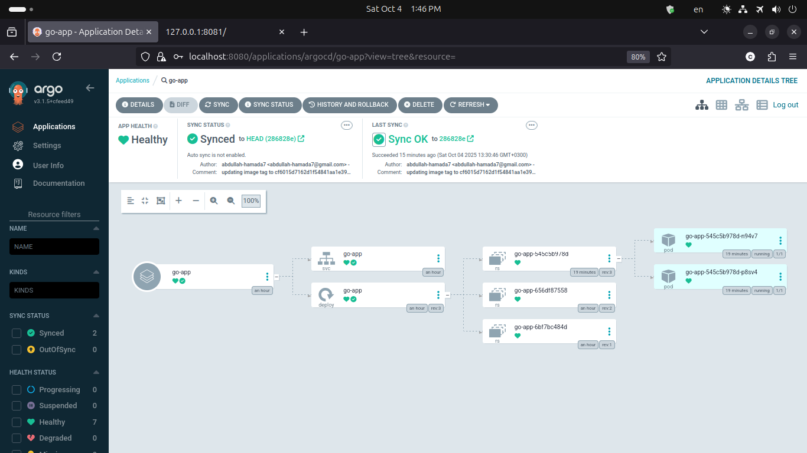
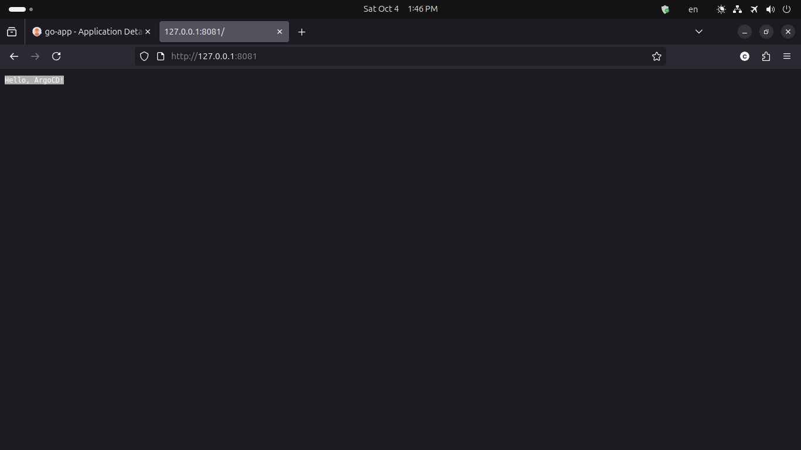

## Deploy Go Application on Minikube using Argo CD

This repository demonstrates a complete GitOps workflow for deploying a simple Go web application to a Kubernetes cluster using Argo CD.
The pipeline builds and pushes a Docker image via GitHub Actions, updates the Helm chart automatically, and syncs the new version to the cluster through Argo CD.

---


### Repository Structure

```
.
├── apps/
│   └── go-app-deploy-minikube.yml     # Argo CD Application manifest
├── chart/                             # Helm chart for the Go app
│   ├── Chart.yaml
│   ├── templates/
│   │   ├── deployment.yaml
│   │   └── service.yaml
│   └── values.yaml
├── main.go                            # Go application source code
├── Dockerfile                         # Container build definition
├── go.mod                             # Go module definition
└── .github/workflows/ci-cd.yml        # GitHub Actions pipeline
```

---

### Components Overview

| Component                   | Purpose                                                                                                     |
| --------------------------- | ----------------------------------------------------------------------------------------------------------- |
| Go Application          | Simple HTTP server responding with `Hello, Argo CD!` and exposing `/healthz` for probes.                    |
| Dockerfile              | Multi-stage build producing a minimal Alpine image for the Go app.                                          |
| Helm Chart              | Defines the Kubernetes Deployment, Service, and probes for the app.                                         |
| Argo CD Application     | Manages automated synchronization between Git and the cluster.                                              |
| GitHub Actions Workflow | Builds and pushes the image to Docker Hub, updates the Helm `values.yaml`, and commits changes back to Git. |

---

### CI/CD Workflow Summary

1. Build Stage

   * Triggered on every push to `main`.
   * Builds and pushes the Docker image to Docker Hub.

2. Update Stage

   * Updates `chart/values.yaml` with the new image tag (commit SHA).
   * Commits and pushes the change to the repository.

3. Deploy via Argo CD

   * Argo CD detects the new commit.
   * Syncs the updated Helm chart to the Kubernetes cluster.

---

### Local Development

Run locally:

```bash
go run main.go
# or
go build -o server main.go && ./server
```

Test endpoints:

```bash
curl http://localhost:8080/
```

Expected output:

```
Hello, Argo CD! 
```

---

### 🐳 Build & Run with Docker

```bash
docker build -t abdullahhamada7/go-app:latest .
docker run -p 8080:8080 abdullahhamada7/go-app:latest
```

---

### Deploy on Minikube (Manually)

```bash
# Start Minikube
minikube start

# Create namespace
kubectl create ns go-app

# Deploy using Helm
helm upgrade --install go-app ./chart -n go-app

# Access the service
minikube service go-app -n go-app
```

---

### Argo CD Setup

1. Install Argo CD in Minikube:

   ```bash
   kubectl create namespace argocd
   kubectl apply -n argocd -f https://raw.githubusercontent.com/argoproj/argo-cd/stable/manifests/install.yaml
   ```

2. Apply the application manifest:

   ```bash
   kubectl apply -f apps/go-app-deploy-minikube.yml
   ```

3. Port-forward or expose Argo CD UI:

   ```bash
   kubectl port-forward svc/argocd-server -n argocd 8080:443
   ```

4. Log in and sync the application:

   ```bash
   argocd login localhost:8080
   argocd app sync go-app
   ```

---

### Verify Deployment

```bash
kubectl get pods,svc -n go-app
kubectl port-forward svc/go-app -n go-app 8080:80
curl http://localhost:8080/
```

---

### Tech Stack

* Go 1.22+
* Docker
* Kubernetes / Minikube
* Helm 3
* Argo CD
* GitHub Actions